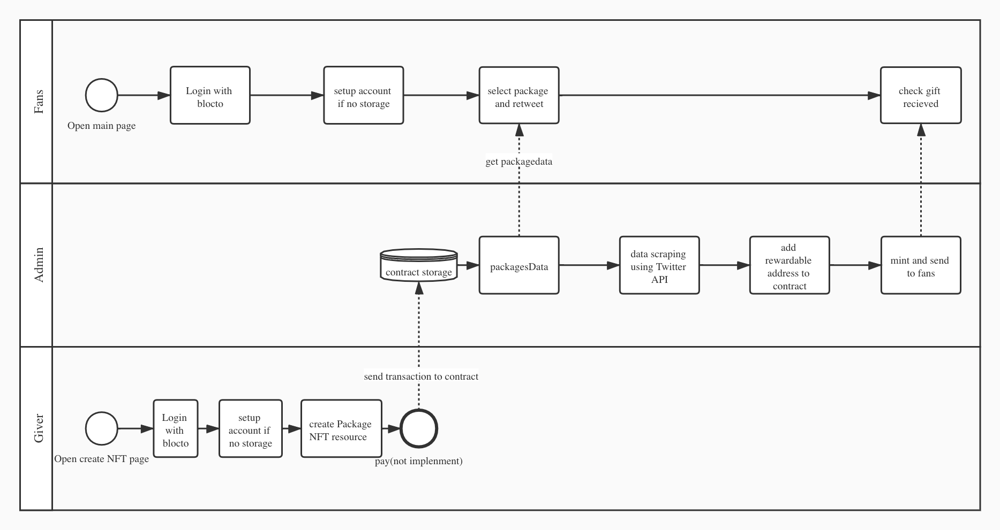

# FanNFT

一款能让KOL轻松地给他的粉丝发放NFT礼物的Dapp，使用flow区块链开发

1. KOL可以设置宣传内容，创建 NFT 礼包
2. 粉丝只需轻点一下“转发到我的推特”，到截止时不删除推文，就有机会获取 NFT 空投
3. 服务端会自动爬取推特，随机选择幸运儿并生成 NFT 礼物发送给他们

## 项目架构

### 流程

### api

使用[flow-python-sdk](https://github.com/janezpodhostnik/flow-py-sdk/)开发，服务端使用Admin的私钥进行签名发送交易，实现“随机选择幸运儿并生成 NFT 礼物发送给他们”。需要手动设置Twitter开发者账户和Admin keys。具体见[api/README.md](./api/README.md)

### web

参考[fcl-demo](https://github.com/portto/fcl-demo)，只做了简单页面用于测试web端和合约交互的所有接口。使用说明见[web/README.md](./web/README.md)

### cadence

核心合约是[FanNFT](./contract/FanNFT.cdc)。transaction中分为giver、admin、fans文件夹，对应不同的角色和权限应该发送的交易。
使用[flow-js-testing](https://github.com/onflow/flow-js-testing)进行测试，使用说明见[cadence/test/README.md](./cadence/test/README.md)